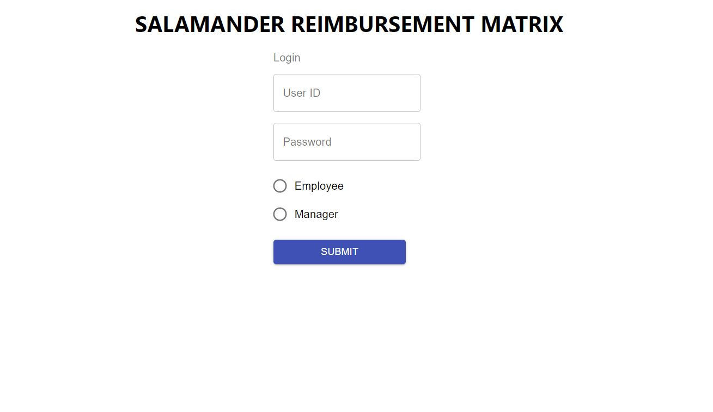
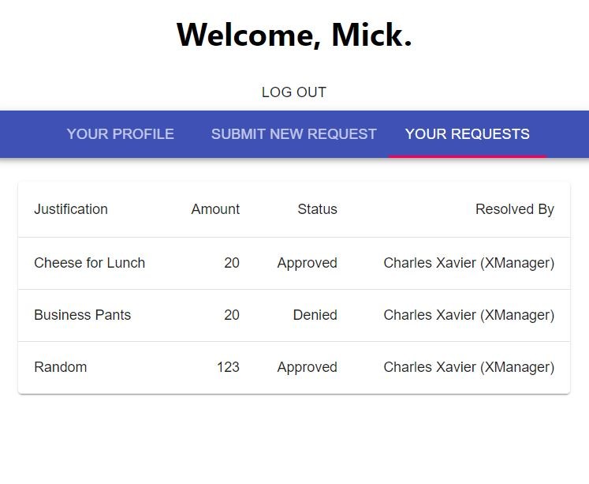

# Employee Reimbursement System (Project Salamander)

      

## Description
Expense Reimbursement System (ERS)

The Expense Reimbursement System (ERS) will manage the process of reimbursing employees for expenses incurred while on company time. All employees in the company can login and submit requests for reimbursement and view their past tickets and pending requests. Finance managers can log in and view all reimbursement requests and past history for all employees in the company. Finance managers are authorized to approve and deny requests for expense reimbursement.

## Site Technologies/Features

## Back-end
- Java
- MVC Architecture 
- Servlets
- Apache Tomcat
- MongoDB
- Java Data Base Connectivity
- Junit

## Front-End
- React
- Redux
- Typescript 

## License

Copyright (c) 2020 Jesse Mazur

Permission is hereby granted, free of charge, to any person obtaining a copy
of this software and associated documentation files (the "Software"), to deal
in the Software without restriction, including without limitation the rights
to use, copy, modify, merge, publish, distribute, sublicense, and/or sell
copies of the Software, and to permit persons to whom the Software is
furnished to do so, subject to the following conditions:

The above copyright notice and this permission notice shall be included in all
copies or substantial portions of the Software.

THE SOFTWARE IS PROVIDED "AS IS", WITHOUT WARRANTY OF ANY KIND, EXPRESS OR
IMPLIED, INCLUDING BUT NOT LIMITED TO THE WARRANTIES OF MERCHANTABILITY,
FITNESS FOR A PARTICULAR PURPOSE AND NONINFRINGEMENT. IN NO EVENT SHALL THE
AUTHORS OR COPYRIGHT HOLDERS BE LIABLE FOR ANY CLAIM, DAMAGES OR OTHER
LIABILITY, WHETHER IN AN ACTION OF CONTRACT, TORT OR OTHERWISE, ARISING FROM,
OUT OF OR IN CONNECTION WITH THE SOFTWARE OR THE USE OR OTHER DEALINGS IN THE
SOFTWARE.

